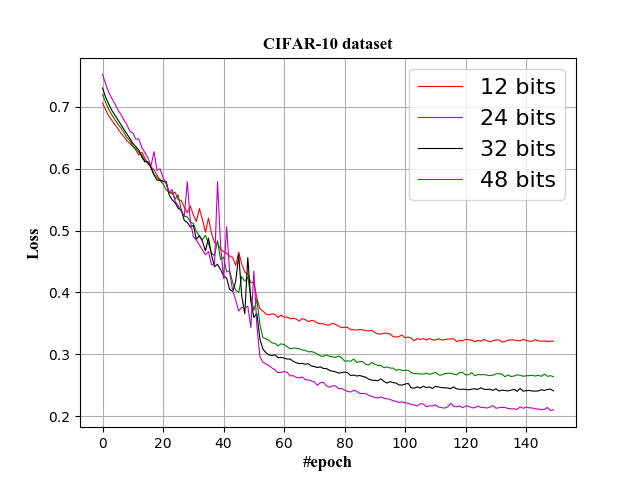
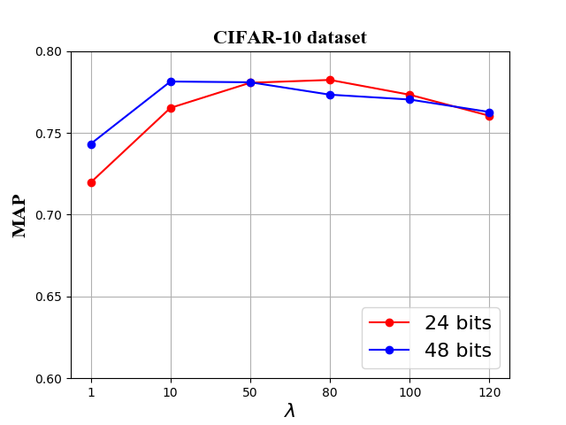

---
A pytorch implementation for paper "Feature Learning based Deep Supervised Hashing with Pairwise Labels"
---
### 1. Running example:
Environment: python 3

Requirements:
```python
pytorch
torchvision
```
### 2. Statement:
As pytorch doesn't provide pretrained VGG-F model, unlike original DPSH [paper](https://cs.nju.edu.cn/lwj/paper/IJCAI16_DPSH.pdf), we use pretrained Alexnet or pretrained VGG-11 for feature learning part instead of pretrained VGG-F.
### 3. Data processing:
Following DPSH MatConvNet source code, we can obtain cifar-10.mat. To prepare data for pytorch version DPSH, run script ./data/CIFAR-10/SaveFig.m to save image files.
### 6. Demo:
```python
python DPSH_CIFAR_10_demo.py
```
### 5. Result:
#### Mean Average Precision on CIFAR-10.
<table>
    <tr>
        <td rowspan="2">Net Structure</td><td rowspan="2">PlatForm</td>    
        <td colspan="4">Code Length</td>
    </tr>
    <tr>
        <td >12 bits</td><td >24 bits</td> <td >32 bits</td><td >48 bits</td>  
    </tr>
    <tr>
        <td >VGG-F</td><td >MatConvNet</td ><td > 0.713 </td> <td > 0.727 </td><td > 0.744</td><td > 0.757</td>  
    </tr>
    <tr>
        <td >Alexnet</td><td >Pytorch</td ><td > 0.7505</td> <td > 0.7724 </td><td > 0.7758 </td> <td > 0.7828 </td>
    </tr>
    <tr>
        <td >VGG-11</td><td >Pytorch</td ><td > 0.7655 </td> <td > 0.8042 </td><td > 0.8070 </td> <td > 0.8108 </td>
    </tr>
</table>

#### Training Loss on CIFAR-10.


### 6. Influence of  Hyper-Parameter \lambda



